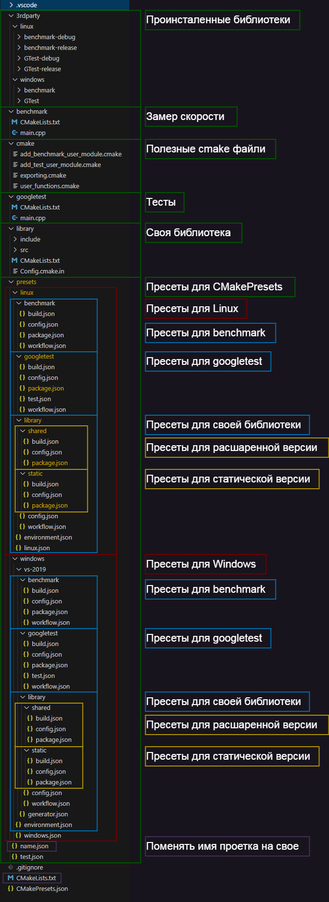

# **Скелет проекта**

## Изменить имя проекта в `CMakeLists.txt` и `presets/name.json`
> Имя проетка должно соответствоть имени директории
### Вывести все `workflow`
~~~
cmake --workflow --list-presets
Available workflow presets:

  "vs-2019-library-static-ci"
  "vs-2019-library-shared-ci"
  "vs-2019-googletest-ci"
  "vs-2019-benchmark-ci"
  "linux-library-static-debug-ci"
  "linux-library-static-release-ci"
  "linux-library-shared-debug-ci"
  "linux-library-shared-release-ci"
  "linux-googletest-debug-ci"
  "linux-googletest-release-ci"
  "linux-benchmark-debug-ci"
  "linux-benchmark-release-ci"
~~~
### Запустить `workflow`
~~~
cmake --workflow --preset vs-2019-benchmark-ci
~~~
### Вывести все `config` (зависить от ОС)
~~~
cmake --list-presets
Available configure presets:

  "vs-2019-library-static"
  "vs-2019-library-shared"
  "vs-2019-googletest"
  "vs-2019-benchmark"
~~~
### Запустить `config`
~~~
cmake --preset vs-2019-benchmark
~~~
### Вывести все `build` (зависить от ОС)
~~~
cmake --build --list-presets
Available build presets:

  "vs-2019-library-static-debug"
  "vs-2019-library-static-release"
  "vs-2019-library-shared-debug"
  "vs-2019-library-shared-release"
  "vs-2019-googletest-debug"
  "vs-2019-googletest-release"
  "vs-2019-benchmark-debug"
  "vs-2019-benchmark-release"
~~~
### Запустить `build`
~~~
cmake --build --preset vs-2019-benchmark-release
~~~
### Вывести все `test` (зависить от ОС)
~~~
ctest --list-presets
Available test presets:

  "vs-2019-googletest-debug-test"
  "vs-2019-googletest-release-test"
~~~
### Запустить `test`
~~~
ctest --preset vs-2019-benchmark-release-test
~~~
### Вывести все `package` (зависить от ОС)
~~~
Available package presets:

  "vs-2019-library-static-package"
  "vs-2019-library-shared-package"
  "vs-2019-googletest-package"
  "vs-2019-benchmark-package"
~~~
### Запустить `package`
~~~
cpack --preset vs-2019-benchmark-release-package
~~~